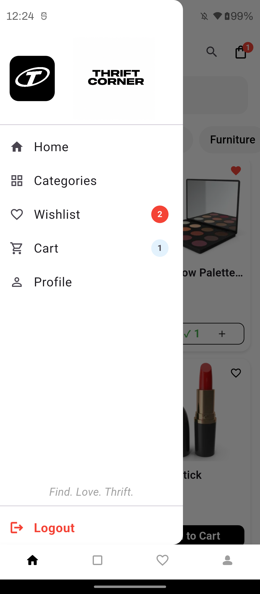

# Thrift Corner 🛍️

A Flutter e-commerce app built with Firebase and BLoC state management.

## Features
- Email & Google Sign In
- Product browsing by category
- Cart & Wishlist with badges
- Coupon codes
- Checkout with order confirmation
- User profile management

## Tech Stack
- Flutter
- Firebase Auth & Firestore
- BLoC
- Google Sign In
- Local Storage

## Setup
1. Clone the repo
2. Run `flutter pub get`
3. Add your `google-services.json` to `android/app/`
4. Run `flutter run`
## Screenshots

               
